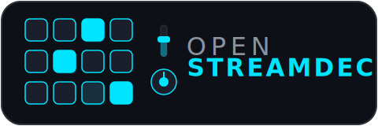

<p align="center">
  
</p>

<p align="center">
  <em>An open-source, fully customizable macro deck built on the ESP32.<br/>No subscriptions, no locked-down software, no cloud dependency.<br/><strong>You own every layer — hardware, firmware, and software.</strong></em>
</p>

<p align="center">
  
  
  
  
</p>

## Why Open StreamDeck?

Commercial stream decks are closed boxes. You can't change the number of buttons, swap the microcontroller, add a fader, or decide how your device talks to your computer. You're renting functionality from someone else's ecosystem.

Open StreamDeck takes a different approach: **the device is yours.**

- **Build it yourself.** Pick your buttons, your knobs, your sliders. Wire them to an ESP32 and flash the firmware. That's it — you have a working macro deck.
- **Modify it freely.** Want 6 buttons instead of 12? Two rotary encoders? A different LED strip? Change a config file and recompile. No permission needed.
- **Write your own software.** The deck speaks a simple JSON protocol over serial. Connect via USB or Bluetooth, read events, send commands. Use any language — Python, C#, Rust, JavaScript — whatever fits your workflow.
- **No accounts. No cloud. No telemetry.** Your keystrokes stay on your machine. The device works offline, forever.

This isn't just open-source software running on proprietary hardware. The entire stack is open — from the circuit to the protocol. Fork it, remix it, sell your own version. It's yours.

## Features

- **12 mechanical buttons** with press, release, and long-press detection
- **Rotary encoder** with rotation and push-button support
- **Analog slider/fader** with noise-filtered ADC input
- **RGB LEDs** (WS2812B) with per-button color control from the host
- **Dual connectivity** — USB Serial and Bluetooth Classic (SPP)
- **JSON protocol** — human-readable, easy to parse, easy to extend
- **Power management** — automatic light sleep when idle
- **Fully configurable** — all pins, timings, and thresholds in a single config file

## Hardware

### What You Need

| Component                | Quantity | Notes                              |
|--------------------------|----------|------------------------------------|
| ESP32 DOIT DevKit V1     | 1        | Any ESP32 with enough GPIOs works  |
| Mechanical key switches  | 12       | Cherry MX, Gateron, Kailh, etc.    |
| Rotary encoder (KY-040)  | 1        | With push button (CLK/DT/SW)      |
| Slide potentiometer      | 1        | Linear, 10kΩ recommended          |
| WS2812B LED strip/ring   | 12 LEDs  | Optional — for button backlighting |
| Wires, enclosure, USB cable | —     | Your choice                        |

### Default Pin Mapping

| Component       | GPIOs                                          |
|-----------------|-------------------------------------------------|
| Buttons (0–11)  | 4, 5, 13, 14, 15, 16, 17, 18, 19, 21, 22, 23  |
| Encoder         | CLK=32, DT=33, SW=25                           |
| Slider          | ADC=34                                          |
| LEDs            | Data=26                                         |

All pin assignments live in [`include/config.h`](include/config.h). Change them to match your wiring.

## Firmware

### Prerequisites

- [PlatformIO](https://platformio.org/) (VSCode extension or CLI)

### Build & Flash

```bash
# Build
pio run

# Upload to ESP32
pio run -t upload

# Monitor serial output
pio device monitor
```

### Configuration

Everything is configured in [`include/config.h`](include/config.h):

- Number of buttons, knobs, and sliders
- GPIO pin assignments
- Debounce timing and long-press threshold
- LED colors, brightness, and enable/disable toggle
- Bluetooth device name
- Power management timeouts

## Protocol

The deck communicates over newline-delimited JSON via USB Serial or Bluetooth SPP (virtual COM port). Full protocol documentation is available in [`PROTOCOL.md`](PROTOCOL.md).

### Quick Reference

**Events from the deck:**
```json
{"btn": 0, "action": "pressed"}
{"knob": "volume", "direction": "up"}
{"slider": "fader1", "value": 2048}
{"status": "alive", "uptime": 60, "bt": true}
```

**Commands to the deck:**
```json
{"btn": 3, "led": "red"}
{"all_leds": "cyan"}
{"brightness": 80}
```

## Project Structure

```
open-streamdeck/
├── include/
│   └── config.h          # All hardware config in one place
├── src/
│   ├── main.cpp           # Entry point — wires everything together
│   ├── buttons.cpp/h      # Button scanning and event generation
│   ├── knob.cpp/h         # Rotary encoder handling
│   ├── slider.cpp/h       # Analog fader input
│   ├── comms.cpp/h        # Protocol layer (JSON encode/decode)
│   ├── bt_serial.cpp/h    # Bluetooth Classic SPP transport
│   ├── usb_serial.cpp/h   # USB Serial transport
│   └── leds.cpp/h         # RGB LED control
├── PROTOCOL.md            # Full communication protocol docs
└── platformio.ini         # Build configuration
```

## Building Your Own Host App

The deck is just one half — you need a host application to make it useful. The protocol is intentionally simple so you can write a companion app in any language:

1. Open the COM port (USB or Bluetooth) at 115200 baud
2. Read lines — each line is a JSON event
3. Send lines — each line is a JSON command
4. That's it

See [`PROTOCOL.md`](PROTOCOL.md) for the complete message reference and a full session example.

## Philosophy

The "open" in Open StreamDeck is not just about the source code being available. It's about ownership.

When you buy a commercial macro pad, you get a product designed around someone else's decisions — their button layout, their software, their update cycle, their cloud service. If they discontinue the product or shut down the servers, your device loses functionality. You never truly owned it.

Open StreamDeck is different. You choose the components. You decide the layout. You write the software that drives it. If something breaks, you fix it. If something is missing, you add it. The device works because of physics and code — not because a company's servers are online.

**This is what owning your tools means.**

## License

MIT — do whatever you want with it.
